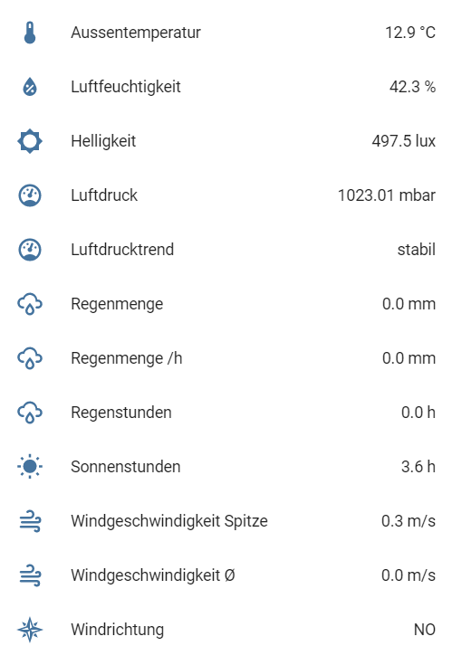

This integration allows you to connect your [STALL WIFFI](https://stall.biz) devices directly to Home Assistant.



## Set up the integration via the integrations screen

Menu: *Configuration* > *Integrations*

Press on **STALL WIFFI** and configure the integration:

* Enter the server port for JSON telegrams sent by the WIFFI device.

## Configure the WIFFI device

1. Set "CCU-IP Adresse myCCUIP" to the IP address of Home Assistant.
2. Set port for JSON telegrams to configured server port using parameter "send_json".

Home Assistant will open a TCP server socket on the configured port and listens for incoming telegrams from WIFFI devices. Entities from new devices will be automatically added.

## Configuration via `configuration.yaml`

Add the following lines to your `configuration.yaml` file:

```yaml
# Example configuration.yaml entry
wiffi:
  servers:
    - port: PORT
```

### Configuration Variables
**port**
    *(integer) (required)*
    The server port for the TCP socket.

## Examples

```yaml
# Example configuration.yaml entry
wiffi:
  servers:
    - port: 8189
```
